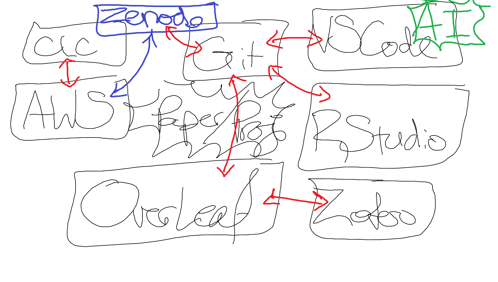

## Objectives

1. Objective 1
2. Objective 2
3. Objective 3

## Template Slide

This presentation now renders as a RevealJS deck through Quarto and can cite the shared project bibliography [@doe2020example].

{fig-alt="Illustration of a person thinking through ideas" width="45%"}

## Conclusions

1. Conclusion 1
2. Conclusion 2
3. Conclusion 3

## References

::: {#refs}
:::
